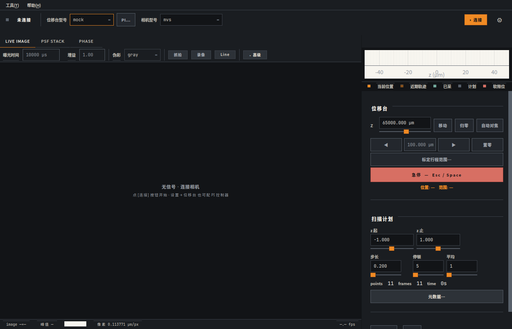
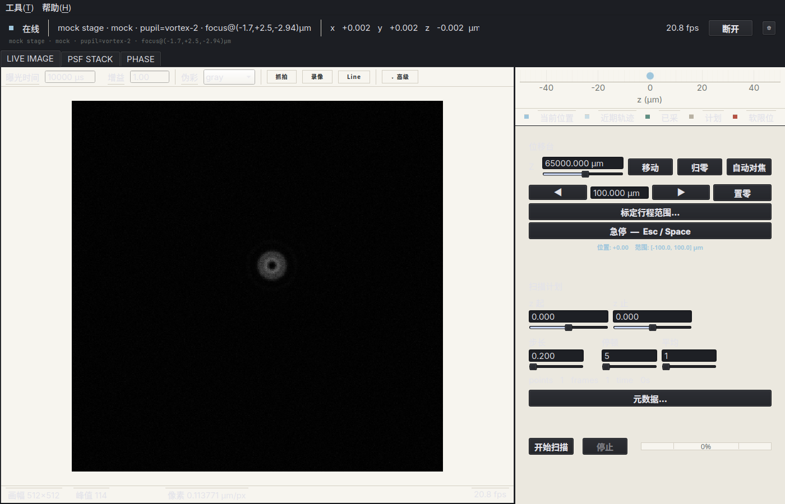
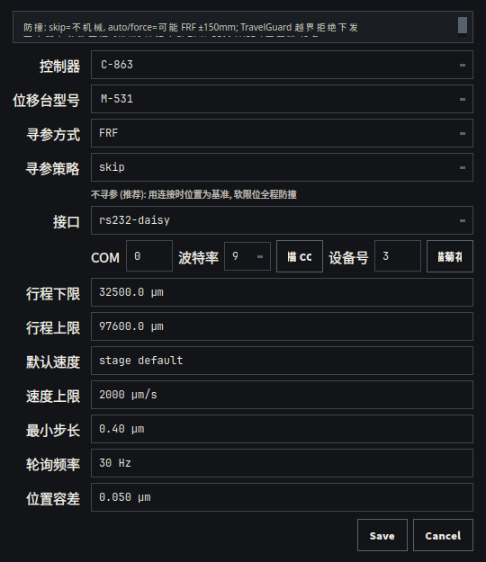

# PSF Scan 使用文档

本文面向日常使用者，按“先安全、再连接、再扫描、最后导出”的顺序说明。

## 1. 软件用途

PSF Scan 用于显微/光学实验中的 PSF 采集与浏览，覆盖以下流程：

1. 连接位移台与相机
2. 手动对位
3. 配置扫描参数
4. 开始扫描并观察进度
5. 自动保存并查看 PSF 结果

## 2. 安装与启动

### 2.1 从安装包启动（Windows）

安装 `PsfScan-Setup-X.Y.Z.exe` 后，从开始菜单启动 `PSF Scan`。

### 2.2 从源码启动（开发环境）

```bash
python -m venv .venv
source .venv/bin/activate
python -m pip install -e .
python -m psf_scan
```

## 3. 界面结构




- `LIVE IMAGE`：实时相机图像
- `PSF STACK`：扫描结果查看
- 右侧 `Stage` 区：路径和当前位置
- 底部控制面板：设备、移动、扫描、进度
- 底部状态条：状态、坐标、数据目录、设置入口

## 4. 第一次使用（推荐流程）

1. 先用 `mock + mock` 跑通一遍流程。
2. 打开设置，配置数据目录与软限位。
3. 再连接真实硬件。
4. 先小范围低风险扫描，确认保存与显示正常。

## 5. 设备连接

## 5.1 Mock 模式

用于离线演练和流程验证。

1. `stage driver` 选 `mock`
2. `camera driver` 选 `mock`
3. 点 `connect`

如果要测试 PHASE 相位重建，可以把 `camera driver` 选为 `mock-interference`。它会直接输出离轴干涉条纹。

普通 `mock` 连接后也可以在相机 `高级` 栏的 `pixel` 下拉里切换：

- `PSF`：默认 PSF 模拟画面
- `Sample`：样品臂强度 `|E_sample|²`，与 `Interference sample` 使用同一个样品复场
- `Reference`：无样品样品臂强度 `|E_reference_object|²`，与 `Interference reference` 对应
- `Interference sample`：带样品相位的离轴干涉条纹
- `Interference reference`：无样品参考干涉条纹，用于 PHASE 的参考矫正
- `Phase shift 0/90/180/270`：同轴相移干涉帧，用于后续相移法验证

## 5.2 MVS 相机

前提：系统已安装海康 MVS Runtime，且相机可被系统识别。

1. `camera driver` 选 `mvs`
2. 点 `connect`
3. 若失败，运行诊断脚本：

```bash
python diagnose_mvs.py
```

## 5.3 PI 位移台（M-531）

前提：PI 控制器与位移台连接正常。



1. `stage driver` 选 `pi-m531`
2. 点 `PI…` 配置接口参数（USB/TCP/RS232 等）
3. 连接时默认 `referencing=skip`（不机械移动）
4. 点 `connect`

说明：连接后可在设置中手动触发寻参（危险操作，见第 11 节）。

## 6. 手动移动与急停

在 `Stage` 区可输入目标 `x/y/z` 并移动。

- 单次大幅 Z 移动会触发确认弹窗（阈值可在设置调整）
- `Esc` / `Space` / 急停按钮会触发 stop

## 7. 扫描参数

常用参数：

- `z start` / `z stop` / `z step`：Z 范围与步长（µm）
- `dwell`：每点采样窗口（ms）
- `avg`：每点平均帧数
- `include xy grid`：是否启用 XY 网格

路径规则：Z 为内层循环；开启 XY 后使用蛇形扫描减少回程。

## 8. 开始扫描

1. 点 `START SCAN`
2. 观察进度条、状态文字、Stage 路径完成标记
3. 点 `stop` 可取消

取消行为：

- 已采到帧：保留并走保存流程
- 未采到帧：仅结束任务，不生成结果目录

## 9. 安全机制（重点）

## 9.1 软限位

设置中的 `safety/x_min..z_max` 会在两处生效：

1. 手动移动前检查目标点
2. 扫描启动前检查整条路径

越界会直接拒绝执行。

## 9.2 大幅移动确认

当单次 Z 目标变化超过阈值（默认 1000 µm）会弹确认框，避免误操作撞机。

## 9.3 PI 寻参提示

PI 寻参会真实机械运动，不受软限位约束；执行前必须确认机械空间。

## 10. 相机参数

`LIVE IMAGE` 可调：

- 曝光（µs）
- 增益（dB）
- 色图
- Advanced：gamma / black level / fps / pixel format（按驱动能力显示）

设置中的 `Enable gamma` 关闭时，advanced 的 gamma 控件会禁用。

## 11. 像素长度标定

像素长度标定用于把相机图像里的 `px` 换算成真实长度 `µm`。启用后，扫描保存时会把标定数据写入结果文件。

### 11.1 像素尺寸 / 物镜倍率

适用于已知相机像素尺寸和物镜倍率的情况。

1. 打开 `Settings -> Camera`
2. 勾选 `启用像素长度标定`
3. `标定方式` 选择 `像素尺寸 / 物镜倍率`
4. 输入相机像素尺寸和物镜倍率
5. 点 `保存`

默认值：

- 像素尺寸：`2.4 µm`
- 物镜倍率：`10×`
- 换算：`2.4 / 10 = 0.240000 µm/px`

### 11.2 画线标定

适用于图像里有已知真实长度的标尺、刻线或样品结构。

1. 打开 `Settings -> Camera`
2. 勾选 `启用像素长度标定`
3. `标定方式` 选择 `画线标定`
4. 点 `保存` 并关闭设置窗口
5. 回到主界面 `LIVE IMAGE`
6. 在相机工具栏点 `Line`
7. 图像上会出现一条线，拖动两个端点对准已知长度
8. 在 Line profile 弹窗里输入这条线的真实长度，例如 `100 µm`
9. 点 `写入像素标定`

写入后，相机底部状态会显示当前 `µm/px`。后续扫描会保存这组画线标定数据。

## 12. PHASE 相位重建

`PHASE` 是和 `LIVE IMAGE`、`PSF STACK` 同级的相位处理工作台，用于处理离轴干涉图并得到相位分布。算法参考 Zhao et al. 2021 的 one-shot off-axis Fourier reconstruction：对干涉图做 FFT，选取一阶旁瓣，滤波后反变换并取相位。

> Mock 干涉图（`mock-interference` 驱动 / 普通 mock 切到 `Interference sample`）使用约 80 cycles/帧 的载频与 NA ≈ 0.025 的低 NA metalens 相位（PV ≈ 11 rad）。这是一个能干净分离 ±1 阶旁瓣、便于离轴 FFT 演示的安全档；真实实验里 metalens 相位 PV 通常更大，需要把载频也按比例往上提（详见 12.5）。

### 12.1 基本流程

1. 打开主界面顶部 `PHASE` 标签。
2. 用 `导入样品图` 选择一张样品干涉图，或用 `当前帧→样品` 把当前相机 raw frame 作为样品图。
3. 默认保持 `自动旁瓣` 勾选。
4. 点 `处理`。
5. 在视图下拉中切换 `INTERFEROGRAM`、`FFT`、`PHASE`、`CORRECTED` 查看预览。
6. 结果确认后点 `保存结果`。

`FFT` 视图会显示一阶旁瓣中心和滤波半径。如果自动检测不准，可以切到 `FFT`，在图上点击旁瓣中心，再调 `旁瓣 x/y/半径` 后重新处理。

### 12.2 无样品参考矫正

如果光路或 CCD 让无样品干涉条纹本身带有系统相位，可以使用参考矫正：

1. 先导入样品图。
2. 用 `导入参考图` 选择无样品干涉图，或用 `当前帧→参考` 取当前相机帧作为参考。
3. 勾选 `参考矫正`。
4. 点 `处理`。

矫正方式是分别重建样品相位和无样品参考相位，然后做 wrapped 相位相减。若不勾选 `参考矫正`，软件会直接显示和保存原始样品干涉条纹重建出的相位。

### 12.2.1 参考平滑 σ (px)

`参考平滑 σ` 控件用于压制"参考路虽然带有真实的低频系统像差,但 CCD/激光噪声让高频抖动也跟着减进结果"这种场景。

- σ = 0(默认):关闭,等同 Zhao 2021 公式 (7)–(8) 的裸减。
- σ > 0:先对参考相位做 `exp(iφ_ref)` 复数域高斯模糊 → 再取角 → 再相减。复数域处理自动绕开 2π 跳变,不需要先做 unwrap。
- 推荐 σ ≈ 2–4 起步。σ 过大会把同心环之类的低频系统像差也磨平,corrected 残差反而抬高。

> **常见误判**:`CORRECTED` 视图看起来"密集条纹/有噪声"≠ 真的有噪声。Wrapped 表示永远落在 [-π, π],只要样品相位 p2p > 2π(metalens 普遍如此),corrected 必然 wrap 多圈,视觉上就是密集条纹。先勾 `导出展开`、保存后看 `phase_corrected.npy`(或在外部把它 unwrap),看到的才是物理上的样品相位曲面。

**判断 σ 是否帮得上忙的速判**:
1. 先看 `phase_corrected.npy` 的 unwrap 版本——如果 unwrap 后只剩样品该有的连续曲面,**根本不需要 σ**,corrected wrapped 的"密集条纹"只是 wrap 假象。
2. 如果 unwrap 后仍有大量高频抖动,再看 `FFT` 视图 + 状态条诊断:旁瓣/DC < 0.05 或对比度 < 0.10 → σ 也救不了,需要回到硬件(平衡两臂强度、对齐偏振、确认光程差落在相干长度内)。
3. 只有"对比度合格、unwrap 后仍有高频随机抖动"这种场景里 σ 才真正有效,推荐区间 2–6 px。

### 12.3 保存内容

PHASE 结果保存到当前数据目录：

```text
<数据目录>/phase_YYYYMMDD_HHMMSS/
```

输出包括：

- `phase_wrapped.npy`
- `phase_preview.png`
- `fft_preview.png`
- `meta.json`

如果勾选 `导出展开`，还会保存 `phase_unwrapped.npy`。如果启用参考矫正，还会保存 `phase_corrected.npy`。

## 13. Settings（设置）

设置分为 5 个标签：

1. `General`：语言
2. `Stage`：软限位、PI 参数、寻参、轴反转、大幅移动阈值
3. `Camera`：gamma 开关、像素长度标定
4. `Calibration`：暗场 / 平场校正
5. `Data`：数据目录

PI 相关建议：

1. 首次连机保持 `skip`，先验证坐标和限位
2. 仅在机械安全时做手动寻参
3. 设置并验证 `Rec- / Rec+` 范围后再做大扫描

## 14. 数据保存

扫描保存目录格式：

```text
<数据目录>/psf_YYYYMMDD_HHMMSS/
```

默认数据目录：系统文档目录下 `PSF Scan`。

每次扫描输出：

- `stack.h5`
- `stack.tif`
- `stack.mat`
- `positions.csv`
- `meta.json`

如果启用像素长度标定，`stack.h5`、`stack.mat` 和 `meta.json` 中会包含 `pixel_calibration`。其中关键字段是 `microns_per_pixel`，单位为 `µm/px`。

### 14.1 快照（snapshots/ 目录）

`LIVE IMAGE` 工具栏 `snapshot` 一次落 4 份文件，文件名共享时间戳前缀（`cam_YYYYMMDD_HHMMSS`）：

- `.tif`：原始位深无损图（用于复算）
- `.png`：当前 colormap 渲染的预览图（人眼检查用）
- `.csv`：像素强度 2D 矩阵（整型 `%d`、浮点 `%.6g`，逗号分隔；可被 Excel / Origin / numpy 直接读）
- `.json`：元数据（保存时间、shape、dtype、当前 colormap、min/max/mean/std；整型还包含 `max_value` / `saturated_pixels` / `saturated_fraction`）

注意：`.csv` 是逐像素文本矩阵，1024×1280 uint16 帧大约 8 MB，频繁抓拍会占用磁盘；如果只要复算精度，从 `.tif` 或 `numpy.loadtxt(csv)` 取数即可。

### 14.2 录像（recordings/ 目录）

`LIVE IMAGE` 工具栏 `record` 启停录像，输出多页 BigTIFF（`rec_YYYYMMDD_HHMMSS.tif`），保留原始位深。录像中切换分辨率或像素格式的帧会被静默丢弃以避免文件损坏。

## 15. 常见问题

## 15.1 启动报模块缺失

```bash
python -m pip install -e .
```

## 15.2 MVS 打不开

- 检查 Runtime 安装
- 检查是否被其它程序占用
- 运行 `python diagnose_mvs.py`

## 15.3 扫描路径为空

检查 start/stop/step 是否能生成有效点，且 step 不为 0。

## 15.4 保存失败

软件会提示重选目录；建议改到当前用户有写权限的目录。

## 15.5 图像显示 SATURATED

说明接近满量程，优先降低曝光，再考虑降低增益。

## 15.6 选择画线标定后不知道怎么画线

画线不在设置窗口里完成。保存设置并关闭窗口后，回到主界面相机画面，点击工具栏里的 `Line`。出现线段后拖动两个端点，再在弹窗输入真实长度并点击 `写入像素标定`。

## 15.7 PHASE 处理后相位看起来不对

先切到 `FFT` 视图确认旁瓣圆圈是否套住一阶旁瓣。如果自动位置不准，在 `FFT` 图上点击正确旁瓣中心，调整半径后重新处理。若无样品条纹本身已经弯曲或倾斜，导入无样品参考图并启用 `参考矫正`。
